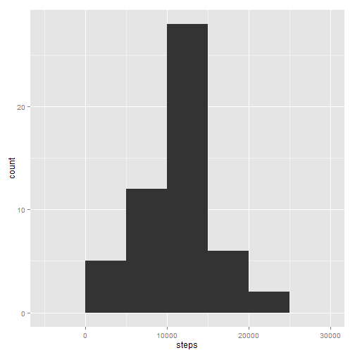

Reproducible Research Peer Assessment 1
========================================================
Douwe Krooshof

## Loading the data file
Note: I assume the activity.csv to be present in the working directory!


```r
setwd("C:/Users/dkrooshof/Desktop/Coursera/Steps")
steps <- read.csv("activity.csv",header=TRUE)
```

I also convert the dates from string to date format:


```r
steps$date <- as.Date(steps$date,format='%Y-%m-%d')
```

## Making the histogram:
- First I aggregate the samples per day
- Then I make a histogram with ggplot2


```r
StepsPerDay <- aggregate(steps ~ date, data=steps, FUN=sum)
library(ggplot2)
qplot(steps, data=StepsPerDay, geom="histogram",binwidth=5000)
```

 

## Mean and median steps per day:
I take the mean and median function with the na.rm option:

```r
mean(StepsPerDay$steps, na.rm=TRUE)
```

```
## [1] 10766
```

```r
median(StepsPerDay$steps, na.rm=TRUE)
```

```
## [1] 10765
```

## Daily activity patttern:
I use the aggregate function again on the original data, now to take the mean per interval number rather than aggregate per day:

```r
StepsPerInterval <- aggregate(steps ~ interval, data=steps, FUN=mean)
```

Then, I make a line plot with the interval number on the x-axis and the mean number of steps per interval on the y-axis:

```r
qplot(interval,steps,data=StepsPerInterval,geom="line")
```

 

The interval with the maximum mean number of steps per interval was found in the following way (835):

```r
StepsPerInterval[which.max(StepsPerInterval[,2]),1]
```

```
## [1] 835
```

## Inputing missing values
I decided to input missing values by assigning a missing value the mean of the interval number. I have got got thi to work yet (sorry!)


```r
StepsAdjusted <- merge(steps,StepsPerInterval,by.x="interval",by.y="interval")
StepsAdjusted$missing = is.na(StepsAdjusted$steps.x)
```


